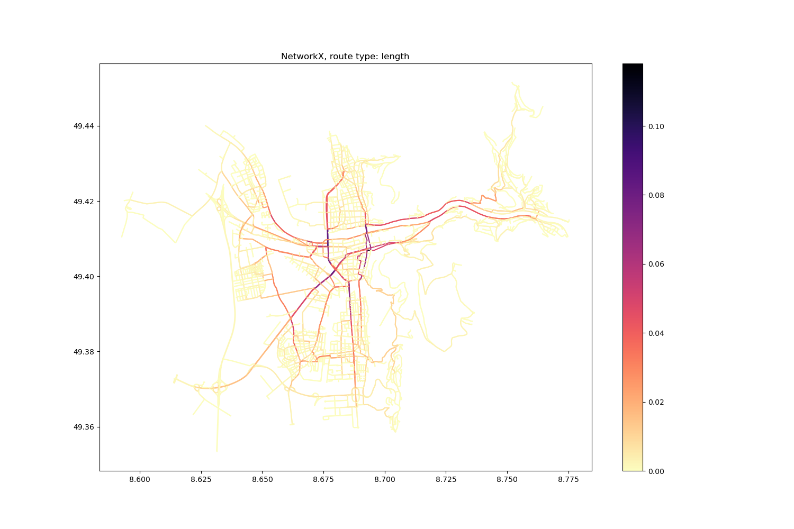
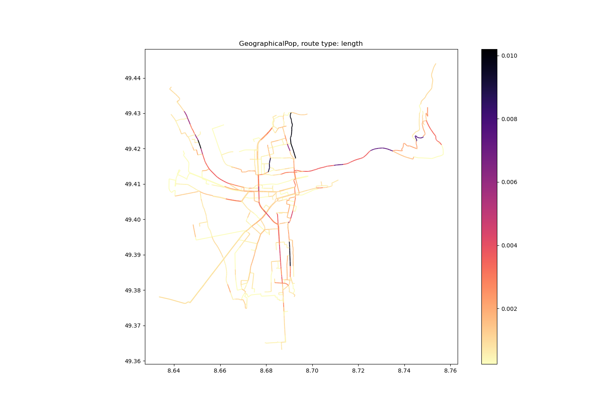

# 06_network_assignment: Betweeness Centrality Analysis

## Introduction
This project was done within the course "Advanced Geoscripting" at the Institute of Geography at Heidelberg University during the Winterterm of 2023/2024. 
  
Originally developed for social networks, betweeness centrality analysis can also be adapted for geographical usecases. As it is used to identify important nodes and edges in graph networks, geographically informed betweeness centrality of road networks can be an indicator for the modelling of traffic speed or for identification of critical roads to support disaster preparedness and management.

This project aims to provide a python program to calculate betweeness centrality based on OpenStreetMap data using different calculation methods that can be set by the user. The figure below gives a first impression on OSM graph networks and geographical betweenness centrality. To run the program follow the given instructions.



## Installation

### 1. Download repository

```
$ git clone https://courses.gistools.geog.uni-heidelberg.de/wk279/06_network_assignment.git   
$ cd 06_network_assignment
```

### 2. Create environment

After cloning the repository you should create an environment containing the needed packages. We recomend using conda for managing python packages. 

```
$ conda create -n network-analysis python=3.10    
$ conda activate network-analysis
```

## Usage

Within the created environment the program can be executed. It is designed to run from the command line. The user can specify a city or area for wich the analysis is done. This city must refere to a OSMnx geocode. The program can be executed as follows:

```
$ python main.py arg1 arg2 arg3 arg4
```

### Arguments

Four Arguments must be provided:
- **arg1** - query to geocode the place you want to analyse (e.g. Heidelberg)
- **arg2** - method to calculate betweenness centrality, can be geographical, geographicalPop or networkx
- **arg3** - route type to generate routes, can be length (shortest routes) or travel_time (fastest routes)
- **arg4** - number of routes to generate

### Output  
The program creates an output folder if it doesn't already exist. Within this output folder a new folder is created containing the place name, the betweenness centrality method, the route type and the number of routes. The following files are stored in the folder: 
- **GeoPackage** containing the graph network including a column called 'centrality' which contains the calculated centrality index for each road segment.
- **Image** (PNG) showing the betweenness centrality of the study area

For more insights check this [Jupyter Notebook](src/betweenness_centrality.ipynb).

## Example

```
$ cd 06_network_assignment/src  
$ python main.py Heidelberg geographicalPop length 100
```
This example calculates the geographically adapted betweenness centrality with start and endpoints for routes based on population density for the city of Heidelberg, Germany. It generates 100 routes for calculation and uses the shortest routes.



## Testing

The tests stored in the `src/tests` folder can also be executed from the command line. To do so, navigate to the src/tests folder and execute test script you want to run.

```
$ cd src/tests   
$ python test_city_analyzer.py
```

## Support

- an301@uni-heidelberg.de
- wk279@uni-heidelberg.de

## Contributing
Contributers welcome.

## Research Questions
The following research questions are answered in a seperate [Jupyter Notebook](src/betweenness_centrality.ipynb).
  
1. Calculate the betweenness centrality based on the shortest route and the one based on fastest route using the networkx package. Where are the biggest differences between them? Which one do you think is more realistic? Create figures to show your findings.
2. Calculate the geographically adapted betweenness centrality using your own implementation from the notebook several times with increasing number of routes. Compare the centrality index to the one calculated using the ox.edge_betweenness_centrality function from the networkx package. How does the difference between the two change with increasing number of routes? Create a figure to show this.
3. Bonus: Implement a function to choose the start and end nodes for the routes using the population data. Calculate the betweenness centrality based on this implementation and compare it with the betweenness centrality based on random start and endpoints. How do the resulting betweenness centrality indices differ?

## Authors and acknowledgment
Contributing authors of the project are Gustav Schimmer (an301@uni-heidelberg.de) & Philipp Friedrich (wk279@uni-heidelberg.de).

## License
The project is licensed under GNU General Public License Version 3 or later, for details see [LICENSE](LICENSE.txt) file.

## Project status
Pending.

## Notes
If you have questions or encounter any problems or improvements running the code, feel free to get in touch with us!